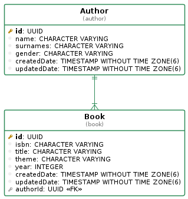

# books-api

    

[](https://github.com/gtormo/books-api/actions?query=books-api%3ACI)

# Guide for developers

## Setup NodeJS & NPM version

To switch to the node version used in this project execute:

```sh
nvm use
```

## Main libraries used

- [TypeDI](https://github.com/typestack/typedi): TypeDI is a dependency injection tool for TypeScript and JavaScript. With it you can build well-structured and easily testable applications in Node or in the browser.
- [routing-controllers](https://github.com/typestack/routing-controllers): routing-controllers allows to create controller classes with methods as actions that handle requests.
- [TypeORM](https://typeorm.io/#/): TypeORM is an ORM. Its goal is to always support the latest JavaScript features and provide additional features that help you to develop any kind of application that uses databases.
- [class-validator](https://github.com/typestack/class-validator): class-validator allows use of decorator and non-decorator based validation.
- [class-transformer](https://github.com/typestack/class-transformer): class-transformer allows you to transform plain object to some instance of class and versa. Also it allows to serialize / deserialize object based on criteria.

## Database diagram



## Manage environment variables


Configure the .env file. You can use .env.sample file as template.

```sh
cat .env.sample > .env
```

## Basic steps to run the application in development mode

1. First up the infra services:
    ```sh
    npm run infra_dev:up
    ```

2. First install the dependencies by executing

    ```sh
    npm i
    ```

3. Finally run the server in development mode (`nodemon` activated) by executing
    ```sh
    npm run dev
    ```

## Testing

```sh
# Only unit and integration tests (also used in our CI/CD)
npm run test:only
# infra up + Unit and integration tests + infra down.
npm run test
# Watch mode.
npm run test:watch
# Coverage.
npm run test:coverage
```

## Build application for production

To generate the bundled code and make it avilable to be included from the `dist` folder into the Docker image, just execute

```sh
npm run build
```

## API REST documentation

The API documentation can be viewed by opening a web browser and navigating to http://127.0.1:$API_PORT/__/apidoc.